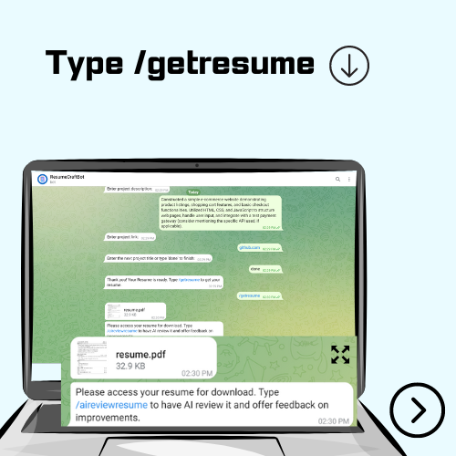

d# ResumeCraftBot

ResumeCraftBot is a AI powered Telegram bot designed to assist users in creating and dowloading professional resumes effortlessly. The bot utilizes Gemini API to provide personalized suggestions, formatting tips, and suggestions to showcase users' skills and experiences effectively.

### Bot Details

- **Bot Name:** ResumeCraftBot
- **Bot Link:** https://t.me/resume_builder_bot

## How to Create a Bot on BotFather

To create a new bot on Telegram using BotFather, follow these steps:

1. Open Telegram and search for "BotFather" in the search bar.
2. Start a conversation with BotFather by clicking on the profile and then clicking "Start".
3. Type "/newbot" to create a new bot.
4. Follow the prompts to provide a name for your bot and obtain the API token.
5. Copy the API token provided by BotFather and use it to authenticate your bot's access to the Telegram API.


## Getting Started

To get started with ResumeCraftBot, follow these steps:

1. **Clone the Repository:**

    ```bash
    git clone https://github.com/yourusername/ResumeCraftBot.git
    cd ResumeCraftBot
    ```

2. **Install Dependencies:**

    ```bash
    pip install google-generativeai
    pip install reportlab
    pip install pyTelegramBotAPI
    ```

3. **Replace Tokens:**

    - Replace `<YOUR_TELEGRAM_BOT_TOKEN>` in the code with your Telegram bot token obtained from BotFather.
    - Replace `<YOUR_GEMINI_API_KEY>` in the code with your Gemini API key.

4. **Run the Bot:**

    ```bash
    python resume_bot.py
    ```

5. **Command Handlers:**
   ```bash
      Command handlers are defined for various bot functionalities:
      -/aireviewresume: Initiates AI review of the resume.
      -/getresume: Generates and sends the resume PDF.
      -/start: Initiates the process of collecting basic details from the user.
   ```

## Functionality

ResumeCraftBot offers the following features:

- **Resume Creation:** Users can input their education, experience, skills, projects, certifications, languages, and basic details to create a professional resume.
- **Resume Generation:** The bot generates a PDF resume based on the provided details using the ReportLab library.
- **AI Review:** Users can request an AI review of their resume using the Gemini API, which provides feedback on completeness, relevance, presentation, grammatical errors, potential rejection factors, key skills, tone adjustment, and content clarity.

## Dependencies

- [pyTelegramBotAPI](https://github.com/eternnoir/pyTelegramBotAPI): Python wrapper for the Telegram Bot API.
- [ReportLab](https://bitbucket.org/rptlab/reportlab/src/master/): Python library for PDF generation.
- [Gemini API](https://geminiapi.com/): AI-powered tools for text analysis.

## Prompt Used
    
    Task Description:
    Your Telegram bot, equipped with the ReviewResumeWithAI feature, is designed to give users a detailed review of their resumes. The resume information is structured in a JSON format, containing sections for       education, certification, experience, skills, languages, and projects. The review should encompass the following key aspects:
    Overall Score: Assess the overall quality of the resume and assign a score out of 100, considering completeness, relevance, and presentation.
    ATS Compatibility: Provide guidance on optimizing the resume for Applicant Tracking Systems (ATS) while maintaining readability and coherence.
    Grammatical Errors: Identify and list any grammatical errors found within the resume content, providing necessary corrections.
    Potential Rejection Factors: Highlight any potential mistakes or shortcomings in the resume that could lead to rejection by potential employers and offer actionable recommendations for improvement.
    Key Skills/Requirements: Analyze the resume data to recommend 2-3 key skills or requirements that the user should emphasize based on their desired job role.
    Tone Adjustment: Evaluate the tone of the resume content and suggest adjustments to make it more professional and aligned with the desired position.
    Content Clarity and Coherence: Provide feedback on the clarity and coherence of the resume content, suggesting any areas that may require further elaboration or refinement.
    User Input (Resume Content - JSON format):
    {file_contents}
    Prompt :
    "Using the provided resume content structured in JSON format, conduct the following tasks:
    i)Evaluate the overall quality of the resume and assign a score out of 100, considering completeness, relevance, and presentation.
    ii)Evaluating the content in JSON file. Suggest user some improvement in the content of resume based on ATS.
    iii)Identify,list and describe all grammatical errors found within the resume content, offering necessary corrections to improve clarity and professionalism.
    iv)Highlight factors that could lead to rejection by potential employers based on the content of resume and point out and quote those errors.
    v)Analyze the resume data to recommend 2-3 key skills or requirements that the user should emphasize based on their desired job role.
    vi)Evaluate the tone of the resume content and propose adjustments to make it more professional and aligned with the desired position.
    vii)Provide feedback on the clarity and coherence of the resume content, indicating any areas that may require further elaboration or refinement based on the content of resume.
    viii)Please ensure that the feedback provided is detailed, actionable, and tailored to assist the user in optimizing their resume effectively for their desired job role."
    ix) Provide Positive in negative of the resume through bullet points
    x) Give descriptive summary of improvement that can be done on the resume

    Note:
    i)Avoid mentioning Gemini or the Telegram bot specifically in the prompt.
    ii) avoid mentioning the json file provided
    iii) Avoid using markdown as it is not supported in telegram use i) or numbers for listing
    iv) Avoid suggesting using different fonts and icons as the resume structured is predefined as it is made using reportlab and user has no control over it.
    v) Describe in detail and use the content in json file to give tailored and precise output
    

## How to use the bot?





## Resume


## Contributing

Contributions are welcome! If you have any ideas for improvements or new features, feel free to open an issue or submit a pull request.

